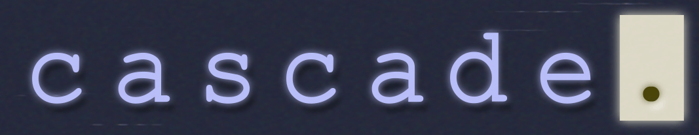
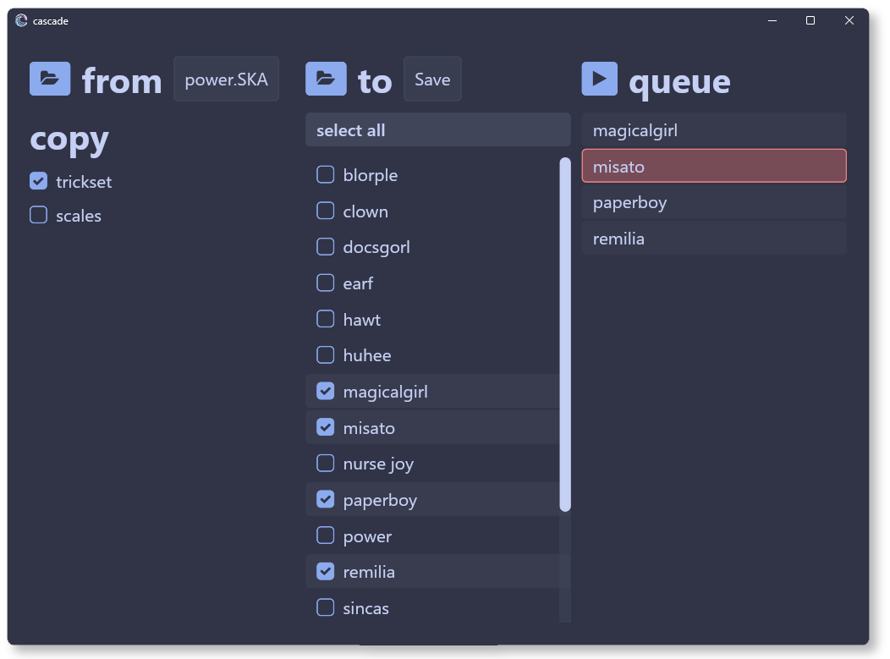
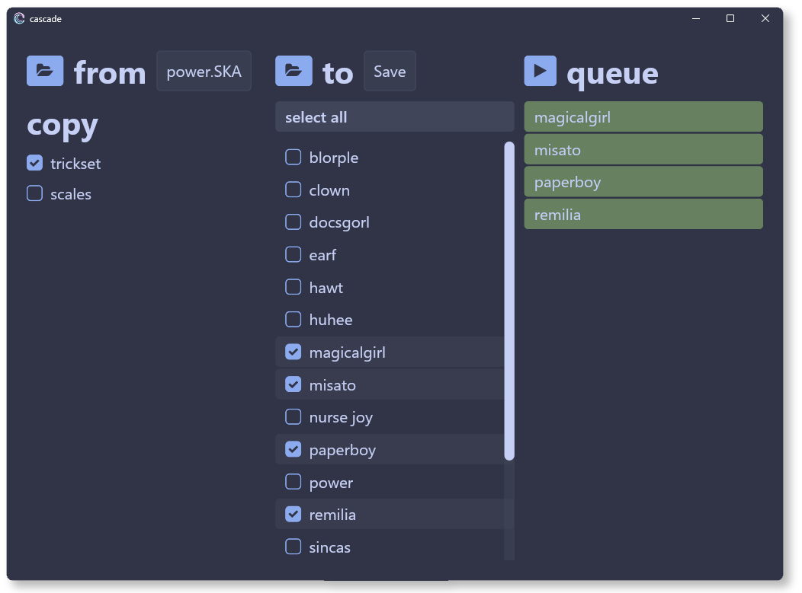

<div align="center">
  
  <div>
    <em>A bulk save modifier for THUG Pro.</em>
  </div>
</div>

## `📸 screenshots`<a id="screenshots"></a>

 

## `📖 table of contents`<a id="toc"></a>

* [installation](#installation)
* [usage](#usage)
* [backups](#backups)
* [contact](#contact)
* [faq](#faq)
* [shoutouts](#shoutouts)
* [development](#development)

## `⏬ installation`<a id="installation"></a>

Download `cascade.exe` from [here](https://github.com/1borgy/cascade/releases/latest).

## `⚡️ usage`<a id="usage"></a>

> [!WARNING]
> I highly recommend making a manual backup of your saves! Though `cascade` has been rigorously
> tested against community CAS packs, the possibility of save corruption still exists.

Upon opening Cascade, you will be greeted with three columns.

### `from`

The "from" column allows you to select the save to copy from. You may choose to copy trickset,
scales, or both.

### `to`

The "to" column allows you to select which saves to copy to.

Cascade will automatically detect your save folder at `%localappdata%/THUG Pro/Save`.
If you have it installed elsewhere, or want to copy saves to a different folder, you will need to
select the desired folder manually.

### `queue`

The "queue" column shows which save files are currently queued to be modified, as well as their
most recent modification status. Upon pressing the start (▶️) button, all saves in the queue will
be backed up then modified in-place.

If modification of a save is successful, it will turn green. If modification of a save results in
an error, it will turn red. If you encounter an error while modifying saves, please 
[contact me](#contact).

> [!TIP]
> Use `ctrl+-` and `ctrl+=` to resize the UI.

> [!TIP]
> Create an empty file named `cascade.toml` in the same directory as the executable to use a
> portable install. Otherwise, cascade will store files at `%localappdata%/cascade`.

## `💾 backups`<a id="backups"></a>

If you want to revert a cascade run, backups are stored at `%localappdata%/cascade/backup`.
Simply pick which backup you want to use and drag its contents into your saves folder.
Each entry in this folder is labeled with the date and time of modification.

## `📣 contact`<a id="contact"></a>

Please direct any questions or concerns towards `@1borgy` on Discord. If you encounter an error,
please send the cascade log file, which you may find at `%localappdata%/cascade/cascade.log`.

## `🙋 frequently asked questions`<a id="faq"></a>

### Why do I get a message saying "SmartScreen prevented an unrecognized app from starting" when trying to run cascade?

To put it simply, this message means that I don't have the certificate required to become a "recognized publisher".

These certificates [cost hundreds of dollars](https://signmycode.com/ev-code-signing), so I don't plan on getting one.

### Do I have to close THUG Pro to copy the trickset to my saves?

Save files are reloaded when entering the "Load Skater" menu, so you do not have to relaunch.

### Why do the file modification times on my saves not change?

This was a design decision I made during development, to preserve ordering of save files.
If you'd like this to be configurable, please [contact me](#contact).

## `✨ shoutouts`<a id="shoutouts"></a>

Cascade would not exist without the following people, so shoutout to them:

- **source** 🧠 for their great work on [castool](https://castool.xyz) and for giving me
  pointers regarding CAS format

- **[@chc](https://github.com/chc)** 🧠 for their great work on the
  [save editor](http://save-editor.thmods.com/#/manage_save)
  and [THPS.API](https://github.com/chc/thps.api/tree/master)

- **[@c4marilla](https://github.com/c4marilla)** 🦆 for being the first beta tester,
  making the project logo and banner, and being appointed cascade project manager ✨

- **retro**, **judy**, and **f1shy** 🦆 for being beta testers

- **cdot** 🛹 for releasing their CAS pack, which is used for automated integration testing

- **[@wermipls](https://github.com/wermipls)** 🪱 for helping with GitHub actions

- **[@catppuccin](https://github.com/catppuccin/catppuccin)** 🐈‍⬛ for providing cascade's color palette

- **[@iced-rs](https://github.com/iced-rs/iced)** 🧊 for powering cascade's UI

# `🛠️ development`<a id="development"></a>

Building cascade requires nightly rust.

```bash
rustup toolchain install nightly
rustup override set nightly
```

To cross-compile for windows:

```bash
cargo build --target x86_64-pc-windows-gnu --release
```

To dump a cas:

```bash
cargo run -p cascade-cli dump -i .local/saves/docsgorl.SKA -o .local/docsgorl.ron
```

To run the UI:

```bash
cargo run -p cascade-app
```
