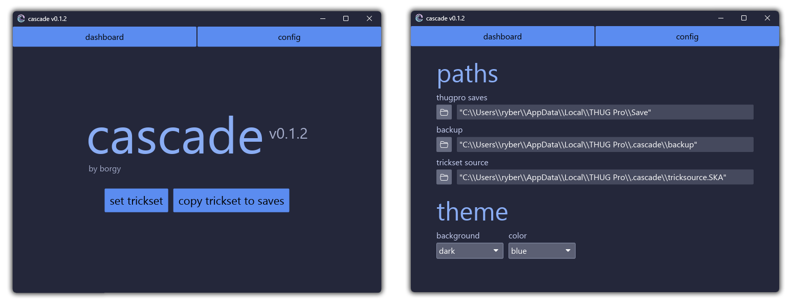

<div align="center">
  
  <div>
    <code>🌊 | a thug pro trickset copier.</code>
  </div>
</div>

# `📸 screenshots`<a id="screenshots"></a>



# `⏬ download`<a id="download"></a>

download `cascade.exe` from
[here](https://github.com/1borgy/cascade/releases/latest).

# `🤠 usage`<a id="usage"></a>

>⚠️  **warning** ⚠️
>
> please make a manual backup of your saves! i've tested this along with a few community
> members and have yet to observe any issues, but your results may vary, as cascade is
> still experimental software.

cascade will automatically detect your THUG Pro installation folder if it is in
`%localappdata%/THUG Pro/`. if you have it installed elsewhere, you will need to
[configure cascade](#configuration).

**using cascade is very easy:**

**one-** click "set trickset" to tell cascade which save's trickset you want to use.

**two-** click "copy trickset to saves" to copy that trickset to all of your saves.

it will tell you how many tricksets were successfully copied - if cascade can't
succesfully copy the trickset to a certain save, it won't touch that save file. this is
typically the case with corrupted saves, or saves from other games (like THUG1 saves).

if you have a save that is failing to be copied, or want to help contribute to cascade,
you can [help the project](#help-me)!

# `💾 backups`<a id="backups"></a>

if you want to revert copying a trickset, or the saves were corrupted for some reason,
cascade stores backups at `THUG Pro/.cascade/` every time it copies tricksets. each
entry in this folder is marked with a date and time so you know when it was backed
up. simply pick which backup you want to use and drag its contents into your
`THUG Pro/Save/` folder.

# `🙋 frequently asked questions`<a id="faq"></a>

## why do i get a message saying "SmartScreen prevented an unrecognized app from starting" when trying to run cascade?

this is not a windows defender message - this message basically means that i don't have
the certificate required to become a "recognized publisher".

these certificates
[cost hundreds or even thousands of dollars](https://signmycode.com/ev-code-signing), so
i don't plan on ever getting one.

## what does “\[... path\] is not set” mean?

this means you are missing at least one of the path entries in the cascade config.
see [configuration](#configuration).

## how can i copy my trickset to only some saves?

currently, you can make another folder, put the saves you want to copy in that folder,
then [configure](#configuration) your `thugpro saves` path to that folder instead.

## how can i use multiple tricksets and swap between them?

i would recommend having a separate folder of tricksets and swapping between them with
the “set trickset” button. you could also [configure](#configuration) your `trickset`
path to swap between them, if that feels better for some reason.

## why do the file modification times on my saves not change?

during development, i found it annoying that copying tricksets would change the order
your saves show up in the “load save” menu, so by default, cascade rewrites the file
modification time to what it was before copying.

i realize this probably shouldn't be default behavior, so please
[yell at me](#feedback) if you want that to be configurable.

## why do not all of my saves copy successfully?

if a save is not copied succesfully, it's likely either a corrupted save or a save from
a different game (e.g. THUG1).

i tested a CAS pack with nearly 300 saves, and only one of them failed. the one that
failed to copy crashed THUG Pro when i tried to open it, so it's safe to say that CAS
is not a valid THUG Pro CAS anyways.

## do i have to close thug pro to copy the trickset to my saves?

from my testing, you don't need to close thug pro. the save files are re-loaded when
loading a new skater.

# `📢 you can help cascade!`<a id="help-me"></a>

please reach out to me on discord **("borgy" in most THPS servers)** with any
questions or comments, especially if you have any issues getting cascade to work.

if you run into an issue, please send me the cascade logs
(you can find these at `THUG Pro/.cascade/cascade.log`) and any CAS that is failing so
i can help diagnose the issue.

i'd also love to hear general [feedback](#i-hate-cascade-it-sucks)! i already have a
[few ideas for improvements](#thinking-emoji).

## feedback 🤬<a id="i-hate-cascade-it-sucks"></a>

```diff
! i want a scale copier!
! i want a save selector for trickset copying!
! i want a cas randomizer! (so do i!)
! i want rotating backups they take up too much room!
! trickset copying is too slow!!! 🤬
! i want a portable install!
! i want a rotating log file!
! i want a configurable source/destination folder for saves!

+ what else do you want to see in cascade?
+ how can the user interface be improved?
+ is the UI's performance poor on your system?
+ etc.
```

## things i've thought about 😔💭<a id="thinking-emoji"></a>

see [github issues](https://github.com/1borgy/cascade/issues).

# `⚙️ configuration`<a id="configuration"></a>

## thugpro saves

this path refers to the folder that cascade reads saves from and copies saves back
to.

by default, cascade autodetects THUG Pro's install folder if it exists at
`%localappdata%/THUG Pro/` (if there is another commonly installed location
[let me know](#help-me)!). 

if your THUG Pro is installed elsewhere, you will need to tell cascade where to look
for saves. click on the `config` tab and select the path for `thugpro saves`. this
path should point to the `THUG Pro/Save/` folder, not the base `THUG Pro/` folder.

## backups 

this path refers to the folder that cascade stores backups in.

by default, cascade will store backups in the `THUG Pro/.cascade/backup/` folder.

## trickset

this path refers to the file cascade uses as the reference trickset when copying a
trickset to saves.

by default, cascade will store the trickset at `THUG Pro/.cascade/trickset.SKA`.

## portable install?

by default, cascade stores all its required files in `THUG Pro/.cascade/`. 

if you prefer a portable install, you can configure these paths to be in the same
folder as the executable. 

currently the cascade config (`cascade.toml`) cannot be moved from this folder, but
that can change [if there is demand for it](#help-me)!

# `✨💫 shoutouts 💫✨`<a id="shoutouts"></a>

cascade would not exist without the following people, so shoutout to them:

- **source** 🧠 for the great work on [castool](https://castool.xyz) and for giving me
  pointers regarding CAS format

- **[@chc](https://github.com/chc)** 🧠 for the great work on the
  [save editor](http://save-editor.thmods.com/#/manage_save)
  and [THPS.API](https://github.com/chc/thps.api/tree/master)

- **[@c4marilla](https://github.com/c4marilla)** 🦆 for being the first beta tester,
  making the project logo and banner, and being appointed cascade project manager ✨

- **retro** 🦆 for being an early beta tester

- **[@wermipls](https://github.com/wermipls)** 🪱 for helping with github actions

- **[@catppuccin](https://github.com/catppuccin/catppuccin)** 🐈‍⬛ for
  [1] blessing my eyes while i waste away in vim and [2] being the color palette used as
  a reference for cascade's themes

- **[@iced-rs](https://github.com/iced-rs/iced)** 🧊 for powering cascade's ui
  and making me not hate frontend that much
